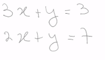
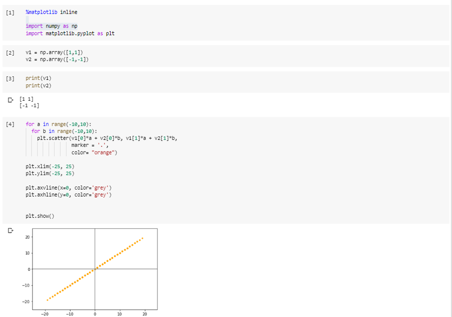
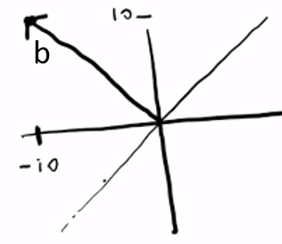
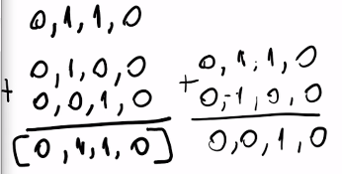
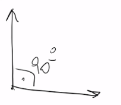

# Curso de Fundamentos de Álgebra Lineal con Python

- [Curso de Fundamentos de Álgebra Lineal con Python](#curso-de-fundamentos-de-álgebra-lineal-con-python)
  - [Modulo 1. Conceptos básicos de Álgebra Lineal y configuración del entorno de trabajo](#modulo-1-conceptos-básicos-de-álgebra-lineal-y-configuración-del-entorno-de-trabajo)
    - [Clase 1 Presentación del curso y la necesidad del Álgebra Lineal](#clase-1-presentación-del-curso-y-la-necesidad-del-álgebra-lineal)
    - [Clase 2 Anaconda + Python, Creación de un entorno y actualización de paquetes](#clase-2-anaconda--python-creación-de-un-entorno-y-actualización-de-paquetes)
    - [Clase 3 Uso de Jupyter Notebook](#clase-3-uso-de-jupyter-notebook)
    - [Clase 4 Creando las bases, escalares, vectores y matrices. Que es un tensor, Como se representa](#clase-4-creando-las-bases-escalares-vectores-y-matrices-que-es-un-tensor-como-se-representa)
  - [Modulo 2 Realiza operaciones basicas](#modulo-2-realiza-operaciones-basicas)
    - [Clase 5 Dimensión de un escalar, vector, matriz o tensor](#clase-5-dimensión-de-un-escalar-vector-matriz-o-tensor)
    - [Clase 6 Transposición, suma de matrices y escalares](#clase-6-transposición-suma-de-matrices-y-escalares)
    - [Clase 7 Suma de matrices y vectores (broadcasting)](#clase-7-suma-de-matrices-y-vectores-broadcasting)
  - [Modulo 3 Operaciones con Matrices](#modulo-3-operaciones-con-matrices)
    - [Clase 8 Producto interno entre una matriz y un vector](#clase-8-producto-interno-entre-una-matriz-y-un-vector)
    - [Clase 9 Producto interno entre dos matrices](#clase-9-producto-interno-entre-dos-matrices)
    - [Clase 10 Propiedades de las matrices: la multiplicación de matrices es asociativa y distributiva, no es conmutativa](#clase-10-propiedades-de-las-matrices-la-multiplicación-de-matrices-es-asociativa-y-distributiva-no-es-conmutativa)
    - [Clase 11 Transposición de un producto de matrices](#clase-11-transposición-de-un-producto-de-matrices)
    - [Clase 12 Como comprobar la solucion de un sistema de ecuaciones lineal](#clase-12-como-comprobar-la-solucion-de-un-sistema-de-ecuaciones-lineal)
    - [Clase 13 Tipos especiales de matrices: Identidad, Inversa, Singulares](#clase-13-tipos-especiales-de-matrices-identidad-inversa-singulares)
    - [Clase 14 Aplicación de la inversa de una matriz para resolver un sistema de ecuaciones lineales](#clase-14-aplicación-de-la-inversa-de-una-matriz-para-resolver-un-sistema-de-ecuaciones-lineales)
      - [Inversa para resolver otro sistema de ecuaciones que contenga los mismos coeficientes](#inversa-para-resolver-otro-sistema-de-ecuaciones-que-contenga-los-mismos-coeficientes)
  - [Modulo 4 Sistema de ecuaciones lineales](#modulo-4-sistema-de-ecuaciones-lineales)
    - [Clase 15 Ejemplos de sistemas sin solución, con una solución y con infinitas soluciones](#clase-15-ejemplos-de-sistemas-sin-solución-con-una-solución-y-con-infinitas-soluciones)
    - [Clase 16 Graficar vectores](#clase-16-graficar-vectores)
    - [Clase 17 Que es una combinacion lineal](#clase-17-que-es-una-combinacion-lineal)
    - [Clase 18 Que es un espacio y un subespacio](#clase-18-que-es-un-espacio-y-un-subespacio)
    - [Clase 19 Vectores linealmente independientes](#clase-19-vectores-linealmente-independientes)
    - [Clase 20 Validar que una matriz tenga inversa](#clase-20-validar-que-una-matriz-tenga-inversa)
  - [Modulo 5 Normas](#modulo-5-normas)
    - [Clase 21 Que es una norma y para que se usa. Desigualdad Triangular](#clase-21-que-es-una-norma-y-para-que-se-usa-desigualdad-triangular)
    - [Clase 22 Tipos de normas: norma 0, norma 1, norma 2, norma infinito y norma L2 al cuadrado](#clase-22-tipos-de-normas-norma-0-norma-1-norma-2-norma-infinito-y-norma-l2-al-cuadrado)
    - [Clase 23 El producto interno como función de una norma y su visualización](#clase-23-el-producto-interno-como-función-de-una-norma-y-su-visualización)
  - [Modulo 6 Matrices y vectores especiales](#modulo-6-matrices-y-vectores-especiales)
    - [Clase 24 La matriz diagonal y la matriz simétrica: sus propiedades](#clase-24-la-matriz-diagonal-y-la-matriz-simétrica-sus-propiedades)
    - [Clase 25 Vectores ortogonales, matrices ortogonales y sus propiedades](#clase-25-vectores-ortogonales-matrices-ortogonales-y-sus-propiedades)
    - [Clase 26 Matrices ortogonales y sus propiedades](#clase-26-matrices-ortogonales-y-sus-propiedades)
  - [Modulo 7 Otras funciones de Algebra Lineal](#modulo-7-otras-funciones-de-algebra-lineal)
    - [Clase 27 El determinante y la traza](#clase-27-el-determinante-y-la-traza)

## Modulo 1. Conceptos básicos de Álgebra Lineal y configuración del entorno de trabajo

### Clase 1 Presentación del curso y la necesidad del Álgebra Lineal

El algebra lineal es el area de las matemáticas que se ocupa de estudiar la relación que existe entre matrices y vectores.

### Clase 2 Anaconda + Python, Creación de un entorno y actualización de paquetes

Instalación de [Anaconda](https://www.anaconda.com/products/individual), aunque para mis notas utilizare Colab.

Ejercicio

```py
import seaborn as sns
vuelos = sns.load_dataset("flights")
vuelos = vuelos.pivot("month", "year", "passengers")
ax = sns.heatmap(vuelos)
```


### Clase 3 Uso de Jupyter Notebook

Uso básico de jupyter notebook.


Por cuestiones de performance nunca excedas las 100 celdas, podemos llamar un notebook desde otro de la misma forma que importamos un modulo.

### Clase 4 Creando las bases, escalares, vectores y matrices. Que es un tensor, Como se representa

Escalares, Vectores, matrices, tensores, se diferencian entre si por los grados de libertad que tenemos para interactuar

- Un vector es un conjunto de números (1 grado de libertad)
- Una matriz es un conjunto  de vectores (2 grados de libertad)
_ Tensor es un conjunto de matrices  (1 o mas grados de libertad que la matriz)


visita <http://mathesaurus.sourceforge.net/numeric-numpy.html>

Reto:

- Escalar 42
- Vector que contenga los escalares 2,5 7
- matriz 2x3
- tensor fila 1 blanco, fila 2 negro, fila 3 gris.

## Modulo 2 Realiza operaciones basicas

### Clase 5 Dimensión de un escalar, vector, matriz o tensor

Las dimensiones de estos son importantes al realizar operaciones en python aunque matematicamente no esten definidas, haran posible realizar estas operaciones.

Un tensor nos sirve para medir la evolución de una matriz en el tiempo, una foto es una matriz, un tensor es un video (cada uno de los estados con un delta de tiempo).


### Clase 6 Transposición, suma de matrices y escalares

Transponer matematicamente hablando es intercambiar sus filas por sus columnas (matriz transpuesta), la suma de matrices es posible siempre y cuando tengan las mismas dimensiones.


### Clase 7 Suma de matrices y vectores (broadcasting)

Broadcasting: es extender la matriz o vector de menor tamaño para que se ajuste a la de mayor tamaño


## Modulo 3 Operaciones con Matrices

### Clase 8 Producto interno entre una matriz y un vector

Para los vectores existen dos modos o maneras de multiplicarlos

- Producto Punto (dot)
- Producto Cruz

“producto interno” toma dos vectores y regresa un escalar.
“producto externo” toma dos vectores y devuelve una matriz.(este no se menciono pero vale la pena lo revisen)


### Clase 9 Producto interno entre dos matrices


### Clase 10 Propiedades de las matrices: la multiplicación de matrices es asociativa y distributiva, no es conmutativa


### Clase 11 Transposición de un producto de matrices


### Clase 12 Como comprobar la solucion de un sistema de ecuaciones lineal

Estableciendo mi sistema de ecuaciones


Solucionando de forma algebraica


Representándolo en forma matricial


Ejemplo en jupyter


### Clase 13 Tipos especiales de matrices: Identidad, Inversa, Singulares

**Matriz identidad** tiene la particularidad de no hacer ninguna modificación es el elemento neutro dentro de las matrices, y no modifica el espacio ya que es una transformacion lineal, tiene una escalera de unos, o los demas elementos seran ceros.


**Matriz inversa**  una matriz es invertible si se puede calcular su inversa, de forma que la matriz por su inversa de lugar a una matriz identidad. Esto significa que A x A^-1 = I. También se dice que una matriz invertible es una matriz regular, no singular, o no degenerada. No existe la posibilidad de que una matriz posea más de una inversa.

La matriz inversa nos permite resolver un sistema de ecuaciones lineales


**Matriz singular** es aquella que no tiene inversa.

Ejemplo


### Clase 14 Aplicación de la inversa de una matriz para resolver un sistema de ecuaciones lineales

Ya que conocemos la matriz inversa, podemos utilizarla para resolver un sistema  de ecuaciones lineales.


#### Inversa para resolver otro sistema de ecuaciones que contenga los mismos coeficientes

 Podemos usar la misma inversa para resolver otro sistema de ecuaciones que contenga los mismos coeficientes multiplicando a las variables, pero  que sea igual a otro  resultado (otro vector)




## Modulo 4 Sistema de ecuaciones lineales

### Clase 15 Ejemplos de sistemas sin solución, con una solución y con infinitas soluciones

**Sistema sobredeterminado:** Más ecuaciones que variables.

**Sistema determinado:** Misma cantidad de ecuaciones y variables.

**Sistema indeterminado o infinitas soluciones:** Más variables que ecuaciones.


### Clase 16 Graficar vectores

Creamos en un notebook  individual la siguiente funcion


Posterior la cargamos en el notebook principal


**Nota:** la instruccion %run permite correr el notebook, la linea anterior solo es necesaria usando Google Colab.

### Clase 17 Que es una combinacion lineal

**Combinacion lineal** es multiplicar un primer vector por un escalar, un segundo vector por otro escalar y sumar el resultado de ambos para obtener un nuevo vector.


La grafica al final del notebook muestra la importancia de las combinaciones lineales, con los vectores correctos podemos generar R2 (describir un espacio entero).


### Clase 18 Que es un espacio y un subespacio

Espacio euclidiano o Espacio vectorial:

Un espacio euclidiano es el conjunto de n-adas ordenadas, tambien conocido por espacio n-dimencional y de denota por Rn este es una sucesión de n números reales ejemplo (a1,a2,...,an) donde los vectores Rn se clasifican así:

R1 = espacio unidimensional, línea recta real.

R2 = espacio bidimensional, pares ordenados.

R3 = espacio tridimensional, terna ordenadas.

**Hiperplano:** una dimension menos el espacio donde estamos trabajando

Si trabajamos en R3 un hiperplano es R2, si trabajamos en R2 un hiperplano es la recta.


### Clase 19 Vectores linealmente independientes


Tenemos un vector V1 y un vector V2 que se multiplica por x

Vemos a la matriz A como un sistema generador donde puede estar generando un espacio o un subespacio.



Analizando


Si proponemos la solucion para el vector b [-10,10] antes de revolverlo con python veamos manualmente la solucion propuesta.



Esto nos ilustra que el vector que estamos intentando escribir vive completamente fuera del espacio vectorial R2, por lo cual este sistema no tiene solucion, esto ocurre porque v1 es linealmente dependiente respecto a v2

v1 es igual a -1 * v2

Un conjunto de vectores es linealmente independiente, si ninguno de ellos se puede escribir como combinacion lineal de los otros vectores.

Si vemos el espacio generado por v1 y v2 es el mismo espacio que se genera solamente usando v1 o solamente usando v2, esto quiere decir que usando los 2 vectores al mismo tiempo no nos aporta información, ni una nueva dimension.

### Clase 20 Validar que una matriz tenga inversa

Para que un sistema de ecuaciones lineales tenga solucion necesitamos que la matriz A que representa a este sistema de ecuaciones sea cuadrada (3x3, 4x4, 5x5) y que todos sus vectores sean linealmente independientes (osea que no contenga ningun vector ld).

Una forma de identificar cual fila de una matriz es linealmente independiente es usar los auto-valores y los auto-vectores.

Que son los auto-valores y auto-vectores es una forma de descomponer nuestra matriz como cuando expresamos un numero como una combinacion de otros, y para el caso de la matriz, la estaríamos descomponiendo como otras tres matrices.


Ejemplo


Comprobamos que la  matriz tiene un vector ld ya que puede expresarse como una suma de otros dos vectores de la misma, o por la transformación de  otros vectores.



Una matriz sin inversa se puede decir qu es singular porque tiene un vector **ld** dentro de sus filas.

También podemos observar este comportamiento en las columnas  


Donde la columna 1 y la 4 son iguales, o visto de otra manera puede ser escrito  como combinacion de las columnas.

## Modulo 5 Normas

### Clase 21 Que es una norma y para que se usa. Desigualdad Triangular

A veces necesitamos medir el tamaño de un vector, para ello usamos una funcion llamada norma.

La norma de entrada recibe un vector y a ese vector se le asocia un numero mayor o igual a cero.

Porque medir conML el tamaño de un vector, para saber por ejemplo cual es el error que estamos cometiendo al hacer nuestras aproximaciones o nuestras clasificaciones.

norma(v) >= 0

norma(v) >= 0 si y solo si v=0

- La norma es el tamaño de un vector, siempre es mayor o igual a 0.

- La norma de un vector es 0 si y solo si el vector es 0

- **Desigualdad triangular:** La suma de dos vectores V1 y V2 nos da un vector V3. La norma del vector es menor o igual a la suma de las normas de V1 y V2.
  
La **norma** de un **escalar** por el vector es el **valor absoluto del escalar** (no importa el signo) por la norma del vector original.


### Clase 22 Tipos de normas: norma 0, norma 1, norma 2, norma infinito y norma L2 al cuadrado

Hay muchos tipos de normas que se usan en ML para medir diversas cosas, algunas son los errores.

- La norma **L0**: devuelve la cantidad de elementos diferentes de 0 del vector.

- La norma **L1**: devuelve la suma de los valores absolutos de los elementos del vector.

- La norma **L2**: La magnitud del vector desde su origen (la distancia Euclidiana).

- L2^2 la misma distancia sin calcular la raiz cuadrada, la ventaja es calcular la norma  a un vector directamente aplicando el producto interno del vector contra si mismo.

x.dot(x.T)

- La norma **infinito**: devuelve el valor absoluto más grande del vector.


### Clase 23 El producto interno como función de una norma y su visualización

Podemos expresar al producto interno de dos  vectores como la norma de cada vector multiplicado por el angulo que están formando.


Para que nos sirve conocer el angulo entre los vectores? una de las cosas que se usan en ML es la similitud coseno.

> si nosotros somos capaces de representar en un vector todas las palabras de un documento, y en otro vector todas las palabras de otro documento, seriamos capaz de determinar el angulo que estos dos vectores están formando y si ese angulo fuese pequeño, quiere decir que ambos se parecen, pero si el angulo fuese de 90 indicaría que no tienen nada que ver el uno con el otro.

## Modulo 6 Matrices y vectores especiales

### Clase 24 La matriz diagonal y la matriz simétrica: sus propiedades

Repaso

**Matriz identidad:** su diagonal es 1 los demás elementos ceros

**Matriz Inversa:** La que al multiplicar por la matriz original produce la matriz identidad

**Matriz Singular:** aquella sin matriz inversa.

**Matriz diagonal**: Aquella con los elementos de su diagonal (no necesariamente cuadrada) son distintos a cero, pero no necesariamente 1 como en la matriz identidad.

**Matriz simétrica*:** aquella que su traspuesta es igual a la matriz original.


### Clase 25 Vectores ortogonales, matrices ortogonales y sus propiedades

**Vector ortogonal:** dos o mas vectores con un angulo de referencia de 90° entre ellos.



**Vector ortonormal:** cuando la norma de los vectores es 1.


Es imposible tener n vectores mutuamente ortogonales en un espacio de dimension n en R2 solo puedes tener 2 vectores a 90 grados, lo mismo para R3 para poder tener un tercer vector mutuamente ortogonal a los dos anteriores.

### Clase 26 Matrices ortogonales y sus propiedades

Una matriz es ortogonal cuando todas sus filas son mutuamente ortonormales y todas sus columnas son mutuamente ortonormales


Las matrices son todas ortogonales con vectores ortonormales, no existe la definición de matriz ortonormal


Matriz de rotación. La cual me permite rotar un vector 90 grados. Es por esta razón que es una matriz ortogonal.

## Modulo 7 Otras funciones de Algebra Lineal

### Clase 27 El determinante y la traza

**Traza:** Devuelve siempre el mismo numero independientemente de que sistema de referencia usemos para expresar nuestra matriz


**Determinante:** nos habla sobre la transformación que ejerce esa matriz sobre el espacio que esta transformando, si estamos en R2 y el determinate es negativo, lo que esta haciendo es darnos el espejo de nuestro espacio.


El area ocupado por la nueva matriz y la matriz original posterior a multiplicarla


